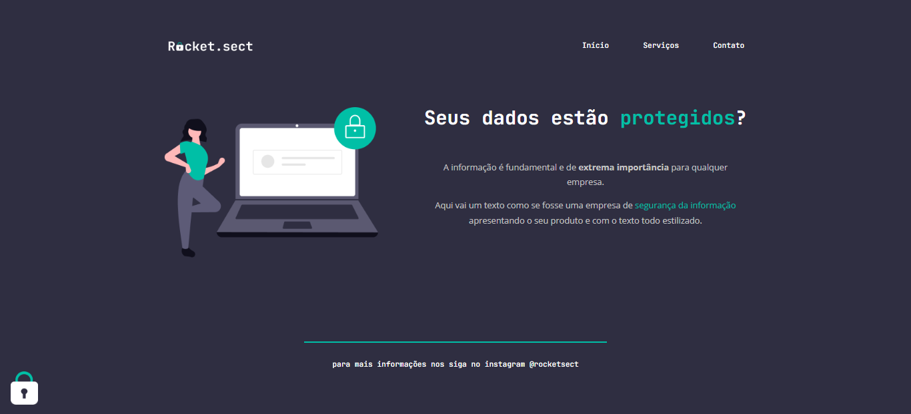

# site_rocket.sect
 

# Projeto Site Rocket.Sect
 
 Repositório criado para apresentar o desafio das aulas da plataforma Rocketseat - módulo Explorer STAGE 02.

 
 
 :fire: Proposta do projeto :nerd_face:

 <h1 align="center"> 
  
</h1>

O que acha de acessar o projeto? 
 <a href="https://oscarlojr.github.io/site_rocket.sect/" target="_blank">Tela Inicial</a>